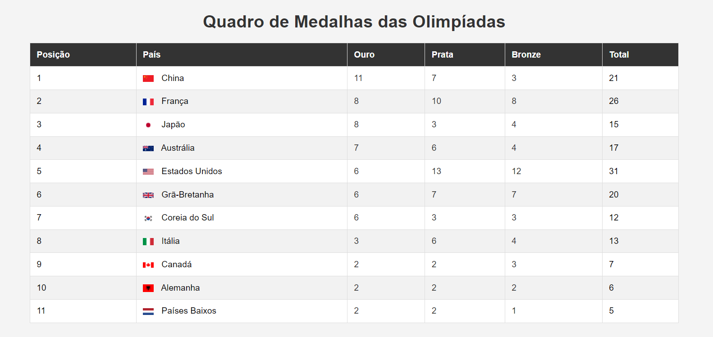

# Exercícios
Atividade extra - Criar um quadro em html, css e javascript de medalhas da olimpiadas 

Lógica: Ele classifica os paises através das medalhas: Prioridade ouro, depois prata e depois bronze.

